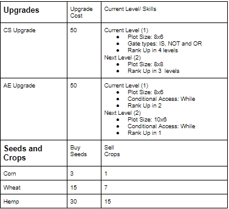

---
waltz:
  title: Educational Game Design Document Template
meta:
  version: 0.0.2
  gdd authors:
    - Kevin Mason and David Olaoye
  template authors:
    - Austin Cory Bart <acbart@udel.edu>
    - Mark Sheriff
    - Alec Markarian
    - Benjamin Stanley
---

# Space Farm

## Elevator Pitch

Space Farm is a game that takes place on a foreign planet and your job is to grow crops and maintain its ecosystem for a period of 30 days. You will be switching between two characters, an Agricultural Engineer (AE) and a Computer Scientist (CS), as your play. Each character has different functionality that will assist you in gameplay. Users will explore the different processes that go into maintaining an ecosystem, such as planting, watering, and harvesting crops while protecting the farm area from wildlife. The player is rewarded with a high score by maintaining this area over the required period of time. 

## Influences (Brief)

- A student in the Agriculture department is building an automated hemp farm :
  - Medium: Experience
  - Explanation: They may be able to provide more insight about maintaining an ecosystem and planting crops that we could utilize in our game mechanics. 
- Being Computer Science students :
  - Medium: Experience
  - Explanation: A student that is fairly new to Computer Science and programming may have a difficult time grasping the concepts of conditional statements and logic gates. We felt we could incorporate these lessons into the game mechanics by making some of the land cultivation automated using these concepts. 
- Animal Crossing
  - Medium: Game
  - Explanation: Animal Crossing is an open-ended game with no definitive objectives where the player is able to interact with anthropomorphic animals and the environment extensively from talking to villagers to planting crops. The idea of cultivating a foreign environment and interacting with unique fictional creatures was inspired from this. 

## Core Gameplay Mechanics (Brief)

- Gather seeds and water crops.
- Work with switches to automate water system.
- Maintain the surrounding ecosystem by neutralizng wildlife.
- Maintain the surrounding ecosystem through selective collection of resources (trees and mountains).
- Build the farming economy of your home planet by collect crops which increaes your score. 

# Learning Aspects

## Learning Domains
- Introductory Computer Science Concepts (Switches)
- Introductory Agriculture Practices (Planting, Watering, Harvesting) 

## Target Audiences

- Computer Science students who are fairly new to programming
- Agriculture students who want to work with automation farming
- Appropriate for anyone (kids and adults) who are interested in science fiction and agriculture 

## Target Contexts

- This would be utilized in introductory Computer Science courses such as CISC 106/108 as either a in-class exercise or homework assignment
- Used to simulate farming situations for hydroponic farms  

## Learning Objectives
- By the end of the lesson, players will be able to identify different types of seeds
- By the end of the lesson, players will be able to use switches to automate watering of seeds.
- By the end of the lesson, players will be able to collect crops which aids their home economy. 

## Prerequisite Knowledge

- Prior to starting the game, the player needs to be able to express concepts of supply and demand. 
- Prior to starting the game, the player should be able to list and explain the concept of switches. 
- Prior to starting the game, players should have a basic understanding of agriculture(planting, watering, harvesting)

## Assessment Measures

As the user steps, the health of the farm decreases if they are unable to protect it against the planet's wildlife. Players recieve points for how much crops they are able to produce. 

# What sets this project apart?
- You can learn multiple skills such as farming and coding concepts
- Can be edited to fit classroom examples
- It’s interactive in many fields of study

# Player Interaction Patterns and Modes

## Player Interaction Pattern

- 1 Player
  - Switch back and forth between two players to manage water movement and harvesting 
  - Use agricultural engineer to gather and plant crops 
  - Use computer scientist to set mines and automate watering with switches 
  - Maintain the ecosystem by protecting the farm area from wildlife  
  - Build home economy by collecting crops after fully grown. 

## Player Modes

- *Single Player*: Switch between the two engineers to manage the farm. (See Characters)

# Gameplay Objectives

- Automate watering
    - Description: Once seeds have been planted, you can automate watering by switching on/off specific pipes when you are playing as the CS 
    - Alignment: In completing this objective, the player will demonstrate their knowledge of switches 
- Harvesting Crops
   - Description: When playing as the AE, the player can plant seeds in the farm area and collect them when they're watered
   - Alignment: In completeling this objective, the player will demonstrate their knowledge of agricultural practices
- Maintain the ecosystem
    -  Description :  The CS can plant mines to neutralize wildlife that threaten the farm area 
    -  Alignment:  The player maintain the ecosystem against threats.

# Procedures/Actions

You can swap between the characters by pressnig 'C' for Computer Scientist or 'A' for the Agricultural Engineer to either: 
- Automate watering or plant mines by hitting '1' or '2' and pressing the SPACEBAR to perform the action 
- Collect resources or plant crops by hitting '1' or '2' and pressing the SPACEBAR to perform the action 

# Rules
- Don't allow the wildlife to reach the farm box.
- Make sure you switch on/off the specific tubing/pipes to water specific rows in the farm area 
- Don't forget to collect the seeds to gain points
- Be careful not to collect all the resources at once 
- Monitor you inventory to see if you have enough material to perform your action 
- Don't misplace your mines

# Objects/Entities
- Animals 
- Trees
- Jungle/Forrest 

## Core Gameplay Mechanics (Detailed)

- *Automate your water system*: build systems for watering and tending to crops. Use the correct nutrient for each plant and expand your farm as you produce more. If you fail to accomplish both the current nutrient and water cycle, your overall score will be penalized. 

- *Build your automation system*: Use the computer scientist to build logic gates for controlling water flow. As your farm expands, so should your automation system. To continue to advance, you must use the planet's resources as a form of material for flow. You must then use your knowledge of logic gates to open up each valve at given times. 

- *Build your home economy*: Increase your home economy by selling your produce back home. You can increase food, income and healthiness of the planet. However, if crop becomes spoiled, this can take a toll on your score. 

## Feedback
Starting the farm will be done by the agricultural engineer
When in maintenance, or agricultural engineer mode, you are meant to collect, plant, and harvest crop.
Failure to do so correctly will lead to score deduction
When I’m building, or computer scientist mode, you are in charge of keeping the system flowing smoothly with the gates you allow to be open or closed. 
As you advance, you are rewarded more seeds but need to find a way of fitting them all into your farm. 
If you take point loss, it will reflect either in the environment around you changing and becoming more dangerous or your home planet lacking greater resources.

# Story and Gameplay

## Presentation of Rules

- Give players a seed
- Require Agricultural engineer to research a seed
- Require agricultural engineer to plant seed
- Require agricultural engineer to create proper nutrient 
- Require computer scientist to build system
- Require both to go out and collect more resources from the forest 

## Presentation of Content

Users will begin by receiving a base plot of land. They will then be given a few seeds and a seed reader. The agricultural engineer should begin planting seeds in a certain way so when the computer scientist builds the system, the water flows to each seed currently and at the time required. Failure to do so will result in either faulty crops or damage to the ecosystem.

## Story (Brief)

The Government sends an agricultural engineer and a computer scientist to another planet to grow a foreign food source for them using unique mechanics, such as condtional statements and logic gates, but if the player fails to harvest well and maintain the surrounding ecosystem, the wildlife begins to revolt. The player has a month to reach their government’s quota to prove to their nation their research was not in vain. 

## Storyboarding
The AE and CS have a weekly supply drop of crops and piping from Earth. They can also gather foreign crops / materials at the risk of being injured by the wildlife. Being that this terrain is completely new, we don’t know if they will grow in the same environments like on Earth. It’s their job to find out what works best for the crops. If they waste the crops they either die of starvation or are killed by the planet’s wildlife. 

The A.E. can perform three functions using condtional statements :  Plant, Harvest, Gather Crops
You start off with while condtional statements (inefficient), then for condtional statements (efficient), or switches (very efficient)
The C.S. can perform three functions using logic gates :  Destroy (Clear fields), Automate Farming, Build Piping 

## Choose Your Mode

Select Single Player or Multiplayer(They run basically the same, but you can move both characters at the same time)
Select between the Agricultural Engineer and the Computer Scientist 
The AE using conditionals for manual labor and the CS uses logic gates for automated farming
You can switch between the two of them using the SPACE bar

## Research, Plant and Create Nutrient Solutions using your Agricultural Engineer!

When you start a new game, a tutorial will begin.
You start off with an empty field, a bag of 8 seeds, being either wheat, corn or hemp, and the wilderness. 
You'll be required to use the AE to research the nutrient needed for the seeds. 
You walk around your plot of land and the wilderness in search of fallen space trash shot at you from your home planet(plastic, metal, etc.) along with resources from the wilderness to make your nutrient depending on the required chemical compound and water.

You place the chemicals in a basin to create the nutrient and put water in it.

To plant, you use conditional statements to place each seed.

Seed capacity increases with levels

## Use the Computer Scientist to build Tubing with Logic Gates to Filter Nutrients to your Crops!

You will then be prompted to switch to the CS(In multiplayer, CS player will be prompted)

As the CS, you use plastic and rubber to make tubing, connecting the first pieces to your basins(cannot be done otherwise)

You use metal to install gates into each tube you previously made, and set a time schedule for each gate to open on flowing the correct nutrient to it's plant.

The basin will denote, using binary, what gate needs to be open so it can flow from the basin's tube. (1 for open 0 for closed)

Each tube will denote the how many seconds it will be before a specific gate within it will open again(See image above of Hemp Nutrient Flow).

Each seed has a timer that is reset after it gets watered. If it does not get watered before it gets to 0, your overall Farm HP will decrease(

## Shop for Upgrades, Buy More Seeds, and Sell Your Crop!

After completing their first tube-gate system in the tutorial, players will be granted access to the shop, where they can buy seeds and sell crops to continue boosting their home economy. 

Characters can also be upgraded to help automate players' farm by buying level-ups in the shop and unlocking higher ranks for the AE and CS. Rank ups will occur during every few levels and inbetween rank-ups, players will be awarded larger farms in either the X or Y direction. 

## Farm Health and Eco-Systems. Probability and Quota. 
The game begins here. Expand your farm. Make your money. Reach your quota after a month. That's what the government wants, right?

Think again.

Although you are competing to reach the quota, you are also a competitor to the alien eco-system you recently inhabited. You will be given an overall Farm HP, in which many different game aspects play a part of. 

1. Your crops: If you are growing unhealthy crops, the first time, the government of your Home Planet fines you, slowing your upgrade speed and making it easier to make a mistake again. Any consecutive times will account in loss of crops and higher market prices. 

2. In early game, because you do not get to pick your seed placement, you'll need to make sure you filter the right nutrient to the right seed. Failure to do this will lead to unhealth crops. This could also damange the soil that surrounds it, leading to sickness in other crops or upset wildlife.

3. Wildlife envolvement: If you make too many changes to the environment that surrounds you, you risk losing overall Farm HP for damaging the eco system, which will bring you closer to failing your quota. The consequences come in forms of animals, sickness, or enraging your government

4. When searching for more materials to build tubes, there is also a probability that your character may be injured, causing a slight loss in Farm HP. The probability changes each time you go off to search.

If you lose all your HP or do not meet quota in a month, you lose and must restart from Day 1.

# Assets Needed

## Aethestics

The aethestics will be very 8bit style and pixelated. The audio will create an immersive atmosphere and the sound effects will whacky allowing playing to feel okay with making mistakes and trying again. 

## Graphical

- Characters List
  - Agriculural Engineer
  - Computer Scientist
- Textures:
  - Wheat
  - Corn
  - Hemp
  - Wiring 
  - Piping
  - Water 
- Environment Art/Textures:
  - New Planet

## Audio

*Game region/phase/time are ways of designating a particularly important place in the game.*

- Music List (Ambient sound)
  - *Game region/phase/time*: *Example 1*, *Example 2*
  - *Game region/phase/time*: *Example 3*, *Example 4*
  
*Game Interactions are things that trigger SFX, like character movement, hitting a spiky enemy, collecting a coin.*

- Sound List (SFX)
  - *Game Interaction*: *Example 1*, *Example 2*
  - *Game Interaction*: *Example 3*, *Example 4*

# Metadata
